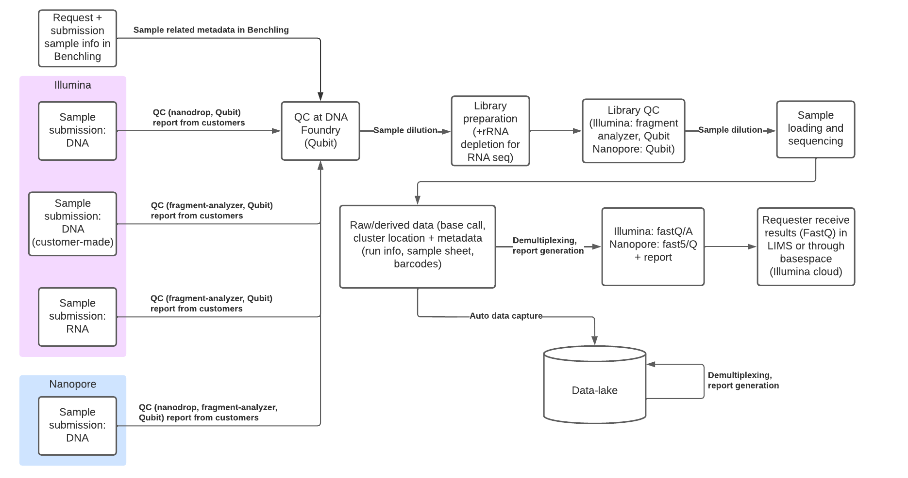

# Next Generation Sequencing

### <ins>Responsibility</ins>
- RDM manager: Lea Mette Madsen Sommer, lemad@biosustain.dtu.dk
- Facility manager: Vijayalakshmi Kandasamy (vijkan@biosustain.dtu.dk)
- Service provider: Vijayalakshmi Kandasamy (vijkan@biosustain.dtu.dk)
- Data capture code: Eren Yagdian, ereyag@biosustain.dtu.dk
- Data steward: Ding He, dinghe@biosustain.dtu.dk
- Documentation: Ding He, dinghe@biosustain.dtu.dk

### <ins>Workflow</ins>

### <ins>Technology</ins>
- Analytical instrument - MiSeq/NextSeq (Illumina)
- Analytical instrument - GridION (Nanopore)

### <ins>Notes</ins>
- Sample information submission and service request are carried out in Benchling.