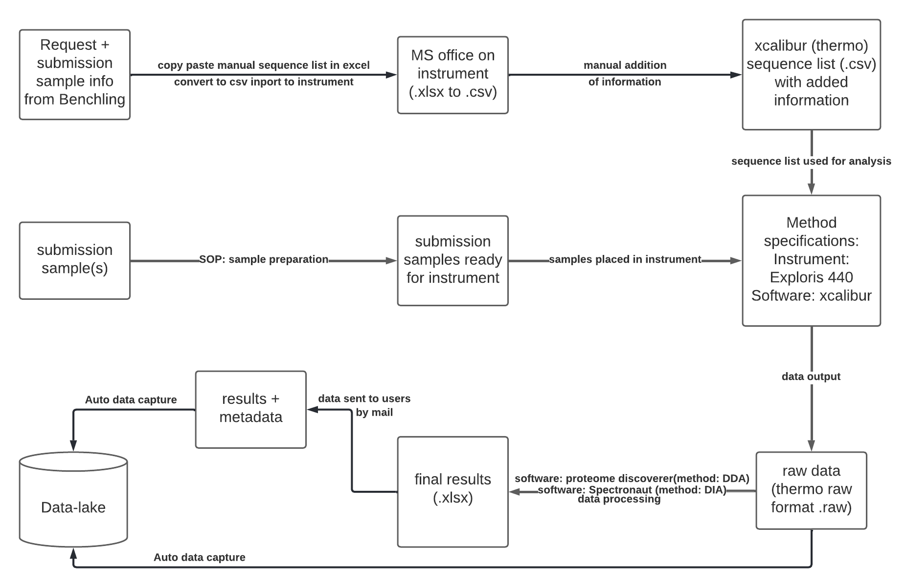

# Proteomics

### <ins>Responsibility</ins>
- RDM manager: Lea Mette Madsen Sommer, lemad@biosustain.dtu.dk
- Lab manager: NA (previously Tune Wulff, tuwu@biosustain.dtu.dk)
- Service provider: NA (previously Tune Wulff, tuwu@biosustain.dtu.dk)
- Data capture code: Eren Yagdian, ereyag@biosustain.dtu.dk
- Data steward: Ding He, dinghe@biosustain.dtu.dk
- Documentation: Ding He, dinghe@biosustain.dtu.dk

### <ins>Workflow</ins>

### <ins>Technology</ins>
- Analytical instrument - Orbitrap Exploris 440 Mass Spectrometer (Thermo Fisher)
- Data processing software - Xcalibur (Thermo Fisher)

### <ins>Notes</ins>
- Currently no proteomics service is provided due to personnel change. 
- Sample information submission and service request in are carried out in Benchling.