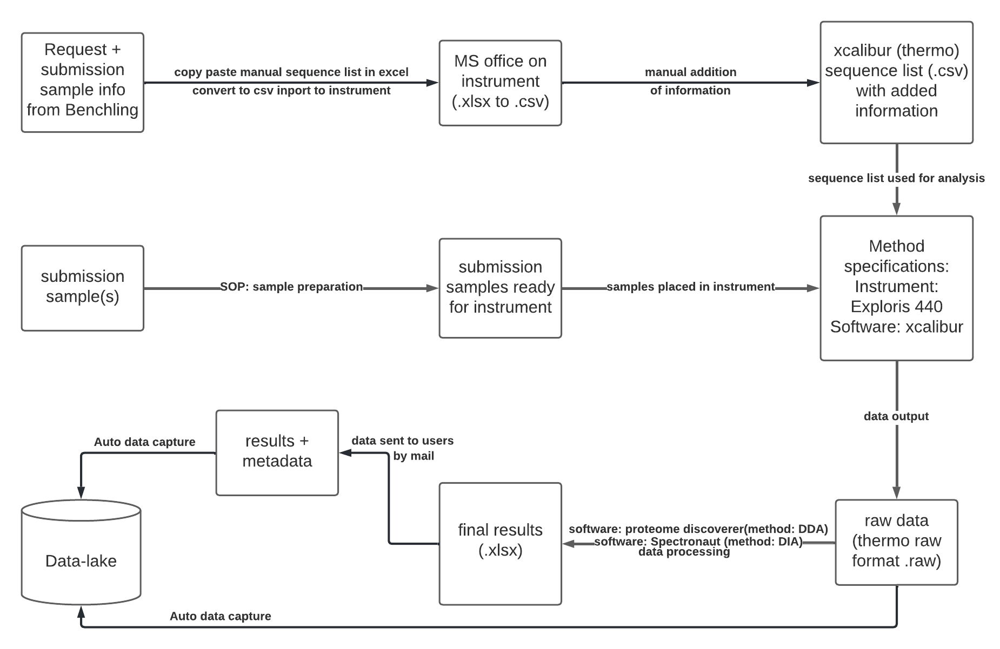

# Important Note
For adminstrative reason, while the sample submission and part of preparations are done at DTU Biosustain, the actual proteomics analytical request and service are currently carried out at DTU Bioengineering. 

# Proteomics

### <ins>Responsibility</ins>
- RDM manager: Lea Mette Madsen Sommer, lemad@biosustain.dtu.dk
- Facility manager: Marie Vestergaard Lukassen (Bioengineering, marluk@dtu.dk)
- Service provider: Marie Vestergaard Lukassen (Bioengineering, marluk@dtu.dk), Lizzie Eriksen (Biosustain, lier@biosustain.dtu.dk)
- Data capture code developer: Eren Yagdian (ereyag@biosustain.dtu.dk)
- Data steward: Ding He (dinghe@biosustain.dtu.dk)
- Documentation: Ding He (dinghe@biosustain.dtu.dk)

### <ins>Workflow</ins>

### <ins>Technology</ins>
- Analytical instrument - Orbitrap Exploris 440 Mass Spectrometer (Thermo Fisher)
- Data processing software - Xcalibur (Thermo Fisher)

### <ins>Data capture machanism</ins>

### <ins>Notes</ins>
- Sample information submission and service request are currently carried out in [PPMS](https://ppms.eu/dtu/) (DTU Bioengineering).